.. Copyright (C) 2019 Tomas Brabec
.. 
.. This document is licensed under Creative Commons Attribution 4.0 International License
.. (cc-by-4.0, http://creativecommons.org/licenses/by/4.0/).

Static Timing Analysis Basics
=============================

This work is licensed under a `Creative Commons Attribution 4.0 International License <http://creativecommons.org/licenses/by/4.0/>`_ |cc_by_40_logo|.

.. |cc_by_40_logo| image:: https://i.creativecommons.org/l/by/4.0/88x31.png
  :alt: CC BY 4.0

.. contents::

Intro
-----

This section sets the stage how to think about digital circuits from the perspective
of static timing analysis and whoever is confident may simply skip directly to
`Static Timing Analysis`_ section.

Digital Circuits
................

Digital circuits can be characterized by two aspects that we will discuss further:

- being sensitive to clock (includes premise of synchronicity)
- abstracting from certain physical aspects (includes use of binary logic)

Existence of a smooth, (usually) fixed known frequency clock is the basic premise of digital
design. From the known frequency we synthesize a coarse grain timing of circuit functions and
we use the clock events to transition the circuit between states, respond to inputs and update
outputs. This essentially views a digital circuit as a state machine, where sequential elements
hold the state and combinational elements define state-dependent functions.

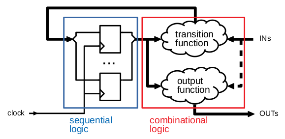

   Generic structure of digital circuits.

The higher level of abstraction increases engineers' productivity that is needed for large scale
digital circuits. Few examples of the abstraction in use:

- Binary logic: Thinking in 0s, 1s and occasionally High-Z and unknowns (Xs) simplifies
  functional reasoning. Here we abstract from actual voltage levels, threshold values and
  the fact that a change from one logic state to another is never discrete.

- Synchronicity: As we idealize the clock, we assume a digital circuit being fully synchronous
  (or multi synchronous in presence of multiple asynchronous clocks). Premise of synchronicity
  lets us disregard many physical aspects that do exist in real world (e.g. dynamic hazards in
  combinational circuits, timing continuity and metastability, etc.).
  
.. TBD example of dynamic hazards in cb + /c/a when a=0, b=1 and c=1->0 (we do not care as long as dynamic behavior settles by the end of clock period)
  
- Gates at lowest level: Circuit design perspective stops at logic gates. Digital designers
  rarely need to think in terms of transistors and other circuit elements that do exist
  on silicon. Similarly to using binary logic, gate level abstraction simplifies reasoning
  about circuit function.

- Static timing analysis abstracts from a continuous spectrum of signal delays through
  a circuit by bracketing each delay with min/max values and then considering the fastest
  and slowest timing paths to construe a conservative, worst case timing model.
  
  Static timing also simplifies the analysis by terminating timing paths at the boundary
  of sequential elements, hence assuming only paths going from a source flop to a sink
  flop with only combinational logic in between. This abstracts the overall system timing
  into an analysis of isolated, discrete flop-to-flop paths. 

The sole point of this discussion is to let you understand that static timing analysis is
set of clever simplifications that shrinks an overly complex reality of circuit timing into
a boring mathematical exercise. Yet those simplifications are conservative enough (sometimes
too much) to guarantee correct function of the circuit, at least in terms of its timing.

Flip-flops
..........

While in discrete design practice there are many types of sequential gates, in digital design we
restrict ourselves to only two types: D latches and D flip-flops. This stems from the expectation
of describing the digital circuit in an HDL language and from the semantics that can be extracted
from such a description.

*D-type latch* (or simply *D latch*) is a sequential element that has a transparent and a stable
state, controlled by a *gate* signal ``G`` (or inverse *enable*). In the transparent state the latch constantly
propagates a data input ``D`` to a data output ``Q``. In the stable state, the data output keeps the last
data input value before the gate "closed". The following figure shows a sample of D latch operation;
for simplicity we ignored any propagation delays.

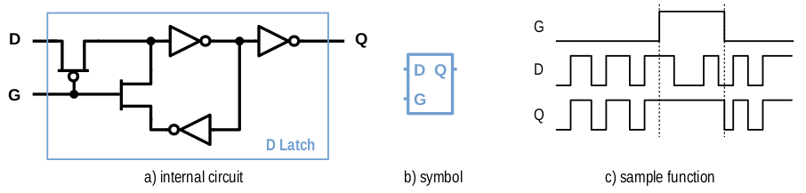

   D-type latch (schematic, symbol and sample waveform).

D latch function can be described by the following HDL code.

.. code-block:: SystemVerilog

  // Verilog syntax
  always @(D or G) begin
      if (G)
          Q <= D;
  end
  
  // SystemVerilog syntax
  always_latch begin
      if (G)
          Q <= D;
  end

The problem with latches is in the transparent mode. An inverting combinational loop from ``Q`` to ``D``
in the transparent mode will start oscillating with a frequency proportional to the cumulative propagation
delay through that loop (see in figure below). Also, a sequence of latches in transparent mode will
create a combinational (or asynchronous) path that spans through one or more sequential elements.
Hence using D latches requires careful design practices where subsequent latch stages use mutually
inverted gate signals and combinational paths (incl. loops) to latches in the same stage are disallowed.

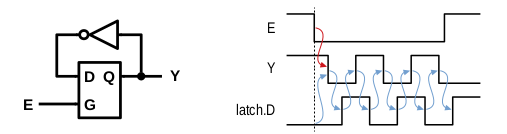

   Oscillations due to inverting loopback through a latch.

*D-type flip-flop* (or just *D flip-flop*, *FF* or simply *flop*) is a sequential element where a data input
``D`` copies to a data output ``Q`` on rising edge event of a clock signal ``CK``. Its implementation usually builds
on a series of D latches, called *master* and *slave*, with inverted gate controls such that every ``CK`` half-period
only one latch is transparent and the other is stable. Hence the clock transition in the direction of the *active edge*
"pours" data from input to output and "locks" it there until the next clock active edge. FF function (ignoring gate
delays) and equivalent HDL code is shown below.

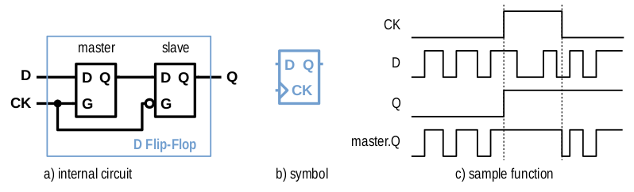

   D-type flip-flop (schematic, symbol and sample waveform).

.. code-block:: SystemVerilog

    // SystemVerilog syntax (Verilog would use just `always @(...)`)
    always_ff @(posedge CK) begin
        Q <= D;
    end

The fact that a flop *captures* the input value in a single, unique moment makes the use of flops extremely
simple. Combinational loops no longer matter and we can connect flops with no restrictions. For this reason
*flip-flops form the foundation of clock sensitive synchronous design*.

FF Timing Parameters
....................

Like any other gates, FFs are built of transistors with non-zero response times. This makes FFs experience
delays needed for *capturing* the input data and posting it at the data output. These delays imply the three
core timing parameters: *Propagation delay*, *setup time* and *hold time*.

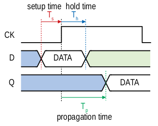

   Waveform diagram showing core flip-flop timing parameters.

Propagation time (Tp)
  This is the time since the clock active edge till the captured data appears on the data output.

Setup time (Ts)
  This is the latest time prior to the clock active edge when the data input needs to stabilize
  to be reliably captured.

Hold time (Th)
  This is the least time after the clock active edge until which the data input needs to remain
  stable to be reliably captured.

The propagation time relates to the delay of the slave latch once becoming transparent after the
clock edge. The setup and hold times have to do with stabilizing the master latch structure and
are thus crucial for correct function of the flop.

In other words, setup and hold time define a window around the clock active edge where the data
input must absolutely be stable. Violating this requirement may lead to an inadvertent situation,
where either data input is not captured (i.e. data output retains its previous value) or, worse,
can get metastable (see `Metastability`_). Hence the setup and hold time requirements lay the basis
of digital circuits timing and, if we oversimplify it, are the sole purpose of static timing
analysis.

.. mention reset removal and recovery as an equivalent to setup/hold

Metastability
.............

Metastability is a subtle and complex subject and for its full understanding be sure to read [Golson2014]_.
Our description here is simplified to let readers comprehend its effects on timing assumptions.

Before we discuss it in more detail, think about static timing analysis as method that checks the data
from a source flop to a sink flop arrives late enough after the hold time, yet early enough before the setup
time of the sink flop. This check computes the time it takes a signal to go through all gates between
the source and the sink, and this time includes the propagation time of the source flop.

Under normal conditions, flipping the source flop's output from one logic level to another takes its
propagation time Tp. When the setup or hold time of the source flop gets violated, that flop may enter
a *metastable state*. In this state the flop's internal circuitry (i.e. inverter loops of its master
or slave latch) stops, when flipping between logic levels, at the verge of stability and its next state
cannot be predicted; it will either complete the flip, or fall back to the previous logic state. The
other troublesome aspect is that the final state resolution will take longer than the propagation time
and, again, that time cannot be predicted.

To help you better imagine what is happening, consider the figure below as a mechanical analogy of a flop:
A ball and a hill (source [Golson2014]_, attributed to [Wakerly87]_). On each side of the hill the ball is
in a stable state, left or right, logic 0 or logic 1. Flipping a flop is like "kicking" the ball up the hill.
Stabilizing the flop's input outside its setup/hold window is like kicking hard enough to let the ball pass
over the hill top and land on the other side, in the other logic state. While entering the setup/hold window
and getting closer to the clock edge, the kick intensity decreases; close to the
clock edge the kick is so weak that the ball does not even get to the top (i.e. lands back where it was and
the flop does not flip). Somewhere in between, there will be a kick intensity that makes the ball reach
the hill top and balance there until it eventually falls on one or the other side; this models the event
of metastability. As you can imagine, the ball may be balancing there anytime long; certainly longer than
with a "strong", flipping kick.

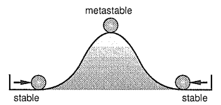

   Metastability mechanical analogy ([Golson2014]_ and [Wakerly87]_).

The next figure (source [Golson2014]_, attributed to [ChaneyMolnar73]_) shows how the metastability presents
itself in practice at the output ``Q`` (and its inverse ``/Q``) of a flop. The blurred area shows the many
resolutions and the time they took.

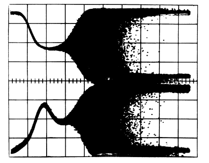

   Oscilloscope trace of a metastable flop outputs ([Golson2014]_ and [ChaneyMolnar73]_).

Now we explain how exactly the metastability and setup/hold times relate to each other. The following figure shows
a plot where the horizontal axis represents time between changes of the flop's clock and data input; on the left
the data input change precedes clock event, and vice versa on the right. The vertical axis represents the time it
takes to flip the flop. Far enough to the left and right, the ``Q`` output flips with a constant delay. The closer
we get with the data change to the clock event (i.e. to the plot origin at 0), the longer the flip will take, until
reaching certain bounds where the flip never happens (i.e. the "Data not captured" region in between the vertical
asymptotes). Close to the asymptotes the flipping time increases exponentially and as you might have guess the
asymptotes represent the metastability.

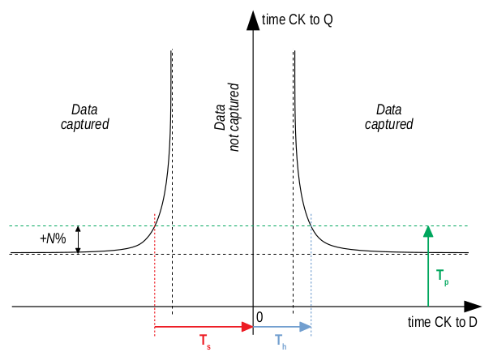

   Flop propagation time as a function of time delay between data and clock inputs change. 

When characterizing the flop's timing parameters, simulations are run to determine a similar plot. The ``CK`` to
``Q`` time is capped at certain percentage of its lowest value (e.g. at plus 10%) and this becomes the propagation
time. The ``CK`` to ``D`` times where the plot crosses the propagation limits become the setup/hold times (on the
left/right). As you see, the setup and hold times are set away, with certain margin, from the actual metastability
region and that is why they guarantee correct function outside the setup/hold stability window. You may also notice
that unless your design will be at the edge of setup/hold times, the actual flop's propagation delay will take less
than the characterized propagation time.

To conclude this short excursion, remember the following:

- Flop's timing parameters are determined conservatively small or large enough to avoid metastability.
- Changing the ``D`` input too close to the clock active edge so that the setup or hold time gets
  violated

  a. may lead to flop's next logic state being unpredictable, and
  b. will cause the propagation delay to ``Q`` exceed the propagation time (and hence invalidate
     our assumptions for static timing analysis).

.. note:: Choosing to represent and constrain flop's flipping function by a set of discrete timing
   parameters is one of the abstractions the digital design takes to simplify its task. As you know the
   timing parameters are derived conservatively and so the design with no static timing violations
   shall be on the safe side that guarantees of correct operation.

Static Timing Analysis
----------------------

The goal of *static timing analysis* (STA) is making sure that all flops (or seq. element in general) in the design
can safely capture their data. Or said differently, STA makes sure that a circuit will correctly perform its function
(yet it tells nothing about correctness of that function; for that there is logic simulation).

Terminology
...........

Understanding terms used in STA is critical for understanding STA itself. We start by explaining the basic
terms; others will come later as we work through to more advanced timing aspects. While explaining the terminology
we also build the foundation of STA concepts. 

Cell, Gate, Net
  *Cell* or *gate* is a combinational or sequential logic element in a circuit. Cells in a circuit are connected
  by wires/*nets*.

Timing arc, Cell arc, Net arc
  *Timing arc* is a timing parameter associated with a logic element/gate or a net/wire delay. Gate timing parameters,
  *cell arcs*, come from timing characterization of that gate function (e.g. see `Metastability`_ for an example of FF
  characterization).
  Net delays, *net arcs*, represent the time it takes a signal to propagate from a driver to a receiver connected
  by that net. It is a function of signal *slew* and that net's RC parameters (incl. capacitance of all receivers on
  the net).
  
  *Cell arcs* are associated with input-output and/or input-input pairs of that gate. Input-output pair arcs
  usually represent a signal propagation delay from that input to that output (e.g. Tp of a flop says how long after
  the clock edge it takes the next flop state to appear on the output). Input-input pair arcs typically represent
  *timing constraints* associated with those inputs (e.g. Ts of a flop constrains the latest time before the clock
  edge for the data input to stabilize). Not all input-input and input-output pairs need to be associated with
  timing arcs; the association arises from the function of that gate.
  
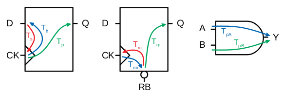

   Examples of cell arcs of a flip-flop (incl. extra arcs due to asynchronous reset ``RB``) and a combinational cell.

Signal path
  *Signal path* from one *cell* to another is a unique path through *nets* and other *cells* in a direction of
  logic signal propagation.

Timing path
  *Timing path* is a set of signal paths going from a *startpoint* to an *endpoint*, see figure below.
  The path is oriented in the direction a logic signal can go (i.e. through the inputs to outputs of logic
  elements along the path).
  
  Not every point in a design can be a *startpoint* or an *endpoint* (see later). Hence the set of *timing paths*
  in a design is limited. Usually *timing paths* start and end in sequential elements and go only through
  combinational logic.
  
  The *timing path* can be broken into a series of *timing arcs* and the path delay becomes the sum of those arcs.
  
  For a given pair of *startpoint* and *endpoint* and hence the *timing path*, there can be several *signal paths*
  through which the logic signal can propagate. This is caused by potential branching and recombination of the
  signal through parallel timing arcs of logic elements along that path.
    
  For every *timing path* an STA engine finds the fastest (*early*) and slowest (*late*) propagation delay. *Early*
  and *late paths* can be the same or different signal paths for the given *timing path*.

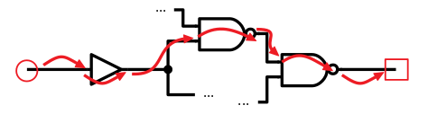

   An example of a timing path broken into timing arcs.

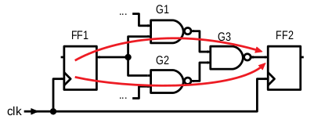

   An example of parallel signal path for a timing path.

Path types
  We can categorize *timing paths* based on different attributes, such as the type of signal that propagates
  along the path or by the *timing check* the path yields, or by the design elements between which the path goes.
  You may encounter the following categorizations:
  
  - By signal type or timing check: *Data path*, *clock path*, *clock-gating path*, *asynchornous path*.
  
    - *Data path* ends at a synchronous data input of a sequential element. Data paths are used for *setup/hold
      checks* or equivalent *timing checks*.
      
    - *Clock path* ends at the clock input of a flop. Clock path is not a *timing path* for which we would
      directly perform *timing checks*; it is used as a complementary path for checking the other path types.
      
    - *Clock-gating path* ends at the clock gating *cell* and is considered for clock gating setup and
      hold checks.
      
    - *Asnchronous path* ends at a flop asynchronous input such as set or clear/reset.
    
  - By path points: *Input to register*, *register to register*, *register to output*, *input to output*.
    
    This categorization is most common for *data paths* as these yield the majority of timing checks in
    a circuit.

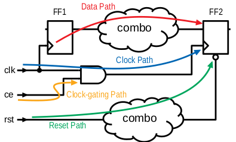

   Path types by signal or timing check type.

Startpoint, Endpoint
  *Startpoint* and *endpoint* are points in circuitry where a signal change starts and ends. The "change end" is
  considered as consuming the signal change within a current clock cycle. Obviously there has to be a *signal path*
  from the startpoint to the endpoint of a *timing path*.
  
  *Startpoint* can be a primary input port or a clock pin of a sequential element.
  
  *Endpoint* can be a primary output port or a data input of a sequential element.

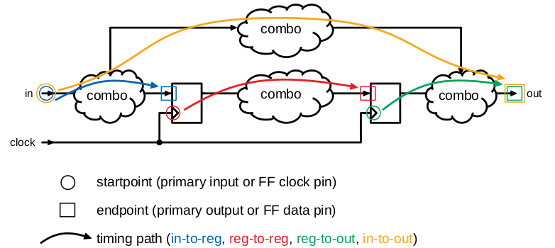

   Different types of data paths, startpoints and endpoints.

From, To, Through
  When specifying a *timing path*, we use identification of points in a circuit through which the path goes.
  Hence *from* and *to* identify *startpoint* and *endpoint* of the path, and *through* is used to identify
  an intermediate point. The point can be a pin name or a cell name (or sometimes a hierarchical block name)
  as long as it uniquely identifies the path; using a pin is the most specific identification.
  
  The *from* and *to* are used to identify a single path or a set of paths. *Through* is often used to select
  one of multiple parallel *signal paths*. These specifiers are typically used in STA tools to report timing
  or specify advanced timing constraints.

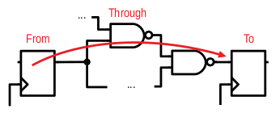

   Illustration of *from*, *through* and *to* points.
  
Launch clock, Capture clock
  *Launch clock* is a clock source that starts/*launches* a signal change in the *startpoint* of a *timing path*.
  
  *Capture clock* is a clock source that samples/*captures* a signal change in the *endpoint* of a *timing path*.
  
  For a given *timing path* the *launch* and *capture clocks* can have the same or different origin. As for the
  clock active edges that yield data *launching* and *cpaturing*, these may be the same or they may be different.

.. examples of launch/capture clocks in figures

Path delays
  *Path delay* is simply a sum of *timing arcs* delays along that path. For a signal path the series of arcs is
  unique. The *timing path* delay is a delay of one of its signal paths, chosen by the attributes we analyze
  (e.g. *early* or *late* path).
  
  *Cell delay* is normally a function of input signal transition/slew and cell output load. *Net delay* is
  a function of RC parameters. Hence the path delay normally varies based on the same parameters.

Constraints
  *Timing constraints* is what drives the static timing analysis as they identify bounds within which
  the circuit timing is deemed correct. Constraints come from two sources: From a technology library and
  from users.
  
  Technology constraints such as setup/hold time, min pulse width, max capacitance or max transition are
  determined for library cells during their characterization. These constraints are considered as
  given for a particular technology and cell library.
  
  User defined constraints define user assumptions on circuit timing and include things like clock period,
  clock waveform, margins defined for circuit inputs and outputs, and their drive and load characteristics.
  User constraints often define certain timing exceptions (e.g. constant signals or parts of designs that
  shall be ignored for analysis) and model timing variances that typically occur in real systems (e.g. clock
  jitter or on-chip parametric variance).
  
  Users can also override constraints from the technology library, either for debugging purposes or to
  model some highly specific aspects. Sometimes other tools are be used to determine cell-specific constraints
  or net delays and their results in a standardized format are back-annotated to the circuit under timing
  analysis.

Timing checks, Setup check, Hold check
  *Timing checks* are the core of the static timing analysis and check if a given *timing path* meets all
  *constraints* associated with it. For example, a data path from one flop to another is checked to have
  propagation delay that does not violate setup/hold times of the target flop.
  
  Indeed setup and hold checks are the most frequent checks in STA. Other checks verify min pulse width
  of clock and reset inputs, recovery and removal times of asynchronous set/clear inputs, data to data
  timing, etc. Some checks do not necessarily involve timing, e.g. cell max load.
  
  *Setup check* and *hold check* enforce data setup and hold of a sequential cell. *Setup check* tests if
  data comes early enough before *capture clock* active edge not to violate setup time of the capturing element.
  Similarly *hold check* tests if data changes long enough after *capture clock* active edge not to violate
  hold time of the capturing element. See the figure below.
  
  Setup and hold checks are the core *timing checks*, many other timing aspects to be tested are converted to
  these two checks (e.g. min/max data delay).

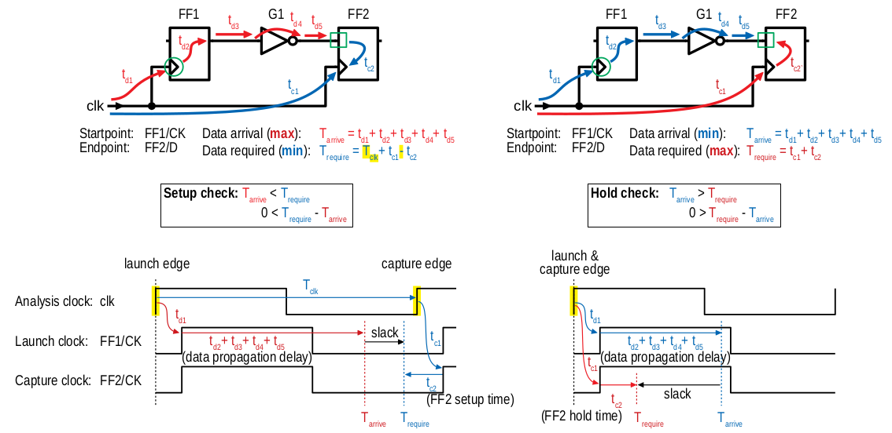

   Principle of setup and hold checks. Notice that each check considers the worst
   case combination of launch and capture timing.

Data arrival, Data required
  If you consider a *register-to-register* timing path, then the *data arrival* is the time when a data change
  from the launch flop arrives at the input of the capture flop. The *data required* is the time when the *capture
  clock* edge arrives at the clock input of the capture flop, adjusted for that flops data *timing constraints*
  (i.e. setup or hold time).
  
  As a data change is triggered by the *launch clock*, the *data arrival* time consists of the *launch clock* propagation
  delay to the clock input of the launch flop and of the flop-to-flop data propagation delay. In the above figure, the
  *data arrival* is a sum of five timing arcs, three *net arcs* (td1, td3, td5) and two *cell arcs* (td2, td4).
  
  Data capture is triggered by the *capture clock* and so represented by that clock propagation time (tc2). Reliable
  capturing is bound by setup/hold times (tc2) [#]_ and so these arcs had to be counted in (subtracted/added) for
  getting the latest/earliest *required* data arrival. Recall the *setup check*; it tests data propagation from one
  clock edge to another and so its *data required* also counts in the clock period. *Hold check* is between the same
  clock edge and so there is no cycle time.
  
  *Data arrival* and *data required* establish the condition for timing checks: For *setup check* data shall arrive
  earlier, for *hold check* it shall arrive later (than *required*). However, there is more to that. For different
  reasons, delays along the *data* and *clock paths* fluctuate [#]_. STA needs to be conservative so it uses such
  combinations of *early* and *late* paths that yield the worst case. Hence *setup checks* compare the *late* data
  arrival to the *early* data required, and vice versa for the *hold check*.
  
  Now abstract from the *register-to-register* path types and you can define the *arrival* and *required* times
  for any combinations of *startpoint* and *endpoint*. You can also generalize the concept on any type of clock
  triggered *timing check* such as recovery/removal or min/max path delay.
  
.. [#] Notice that the arc direction in the figure indicates, if that arc adds/subtracts (same/opposite direction)
   to the overall path delay.
   
.. [#] You will see later in exercises. There can be multiple parallel *signal paths* between the *startpoint* and
   *endpoint*, each with different delays. *Cell arcs* delays may change with polarity of the signal. There can be
   clock uncertanties, signal slew variations, etc.
  
Slack
  *Slack* is the amount of time by which a violation of a *constraint* is avoided.
  
  In *timing check* calculations the slack is typically calculated as time of *data required* less time of *data
  arrival* (i.e. ``slack = Trequire - Tarrive``). In case of a hold check, this difference will come out negative when the
  hold constraint is met (see the above figure) . However, by its definition a negative *slack* indicates a violation
  and so the hold slack is reported as the negated outcome of the slack formula.

Examples
........

This section is to practice STA basics introduced throughout the `Terminology`_ section. It is composed
as a series of exercises with increasing complexity (in terms of STA concepts). It is recommended that
you first try out the exercise yourself and only then go on reading through a documented solution.

In each exercise, the objective and tasks are typeset in *italics*. The solution and other comments are
typeset in the normal font.

In all exercises we **consider nets as ideal** and hence ignore their delays.

Exercise 1: Simple FF-to-FF Path
~~~~~~~~~~~~~~~~~~~~~~~~~~~~~~~~

*Objective: Practice calculation of setup and hold checks. Introduce a typical listing of arrival and
required times calculation.*

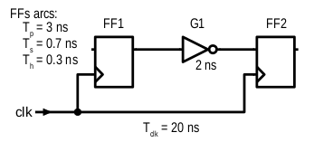

   Exercise 1 circuit.

*Tasks: For the FF1 to FF2 timing path in the figure do:*

- *Identify startpoint and endpoint of the FF1 to FF2 timing path.*
- *Calculate launch and capture clock timing.*
- *Calculate setup and hold slack.* 

As per definition, the startpoint is ``FF1/CK`` and the endpoint is ``FF2/D``. The launch and capture clocks
are ``FF1/CK`` and ``FF2/CK``, both sourced from ``clk``. With the clock cycle of 20 ns the default clock waveform
looks like in the figure below. From that, the setup and hold launch edge is at time ``T=0 ns``. The setup check
tests that data arrives earlier than the next capture edge and hence the setup capture edge is at ``T=Tclk=20 ns``.
The hold check tests that data arrives later than the same capture edge and hence the hold capture edge
is at ``T=0 ns``.

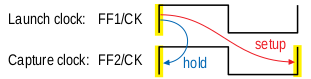

   Shows the default launch and capture timing.

Now for slack we need to determine *data arrival* and *data required* times and calculate their difference.
We usually display the calculation in a tabular form such that *arrival* is first and *required* next; *slack*
appears as the last. We use three columns: Timing point, Delay increment, and Total delay. The Timing point
identifies a timing arc, value of which implies the Delay increment. The Total delay just accumulates increments
along the path.

For our example the setup slack calculation then looks like follows::

    Point             Incr   Total
    clk (rise)          0        0
    FF1/CK              3        3
    G1/A                2        5
    FF2/D               0        5
    data arrive                  5
    
    clk (rise)          0       20
    FF2/CK              0       20
    FF2 setup          -0.7     19.3
    data required               19.3
    
    slack (required - arrive)   14.3 > 0  => setup check passed

Similarly for hold slack::

    Point             Incr   Total
    clk (rise)          0        0
    FF1/CK              3        3
    G1/A                2        5
    FF2/D               0        5
    data arrive                  5
    
    clk (rise)          0        0
    FF2/CK              0        0
    FF2 hold            0.3      0.3
    data required                0.3
    
    slack (required - arrive)   -4.7 < 0  => hold check passed

Exercise 2: Effect of Negedge Clocking
~~~~~~~~~~~~~~~~~~~~~~~~~~~~~~~~~~~~~~

*Objective: Discuss and show effects of mixing flops with different edge sensitivity in a timing path.*

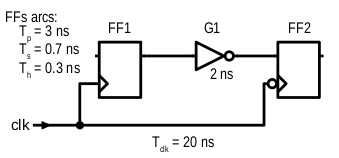

   Exercise 2 circuit.

*Tasks: For the FF1 to FF2 timing path do:*

- *Calculate launch and capture clock timing.*
- *Calculate setup and hold slack.* 

The only difference to `Exercise 1: Simple FF-to-FF Path`_ is that FF2 is clocked on a falling edge. This
affects the *launch time* and *capture time*. For the *setup check*, data is launched on ``FF1/CK`` rise and
captured on the next ``FF2/CK`` fall. Hence for the launch time ``T=0 ns`` the capture time is ``T=10 ns``.

::

    Point             Incr   Total
    clk (rise)          0        0
    FF1/CK              3        3
    G1/A                2        5
    FF2/D               0        5
    data arrive                  5
    
    clk (fall)          0       10
    FF2/CK              0       10
    FF2 setup          -0.7      9.3
    data required                9.3
    
    slack (required - arrive)    4.3 > 0  => setup check passed

For the hold check, we test that data launched by ``FF1/CK`` rise is not captured by the closest preceding
capture clock (i.e. ``FF2/CK`` fall). Hence for the launch at ``T=0 ns`` the closest preceding capture would
be ``T=-10 ns``. STA avoids negative values in launch and capture timing and hence we shift the setting by
one clock cycle, yielding launch and capture at ``T=20 ns`` and ``T=10 ns``.

::

    Point             Incr   Total
    clk (rise)          0       20
    FF1/CK              3       23
    G1/A                2       25
    FF2/D               0       25
    data arrive                 25
    
    clk (rise)          0       10
    FF2/CK              0       10
    FF2 hold            0.3     10.3
    data required               10.3
    
    slack (required - arrive)  -14.7 < 0  => hold check passed

Now consider the opposite case when the launch clock is triggered on the falling edge and the capture
clock on the rising edge. How would the launch/capture times change? And how would the setup/hold slack
change? The following figure puts the two cases in contrast.

.. note:: Mixing the opposite edge triggered flops in the consecutive flop stages helps to increase
   the hold timing margin at the expense of the setup timing margin. This technique is often seen with
   analog designers who do not usually use STA techniques (typical for the same edge digital designs).
   It is also a common practice in serial interface protocols (e.g. I2C, SPI, JTAG). The importance of
   this practice will be explained in `Exercise 4: Parallel FF-to-FF Paths`_. 

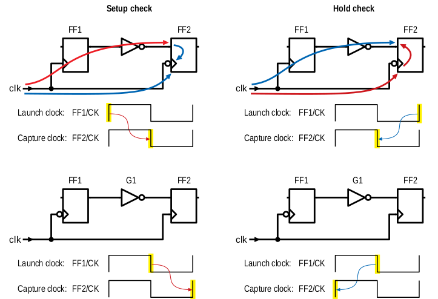

   Shows effects of opposite edge triggered flops on setup and hold checks.

Exercise 3: Simple FF-to-FF Path with Clock Tree
~~~~~~~~~~~~~~~~~~~~~~~~~~~~~~~~~~~~~~~~~~~~~~~~

*Objective: Practice setup/hold slack calculation with cells present in clock paths. Contemplate on
possibilities of fixing timing violations.*

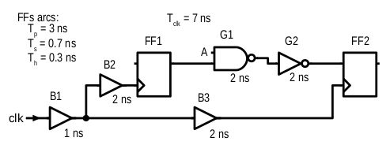

   Exercise 3 circuit.

*Tasks: For the FF1 to FF2 timing path do:*

- *Calculate launch and capture clock timing.*
- *Calculate setup and hold slack.*
- *Contemplate the case when G1/A is constant log.0.*

In previous exercises we used *ideal clocks* that had no clock propagation delays. In most circuits
the clock signal is heavily loaded and buffers are inserted in the clock path segments (to prevent
max capacitance violation), creating a tree-like structure that we call the *clock tree*.
Inserting a clock tree introduces delays into clock paths and makes the clock event arrive to different
flops at different times. We call this difference the *clock skew*. Large clock skews may be one source
of timing violations.

In our example, buffers in the clock tree affect the launch/capture timing and final slacks as follows::

    # Setup slack calculation                               # Hold slack calculation
    Point             Incr   Total                          Point             Incr   Total
    clk (rise)          0        0                          clk (rise)          0        0
    B1/A                1        1                          B1/A                1        1
    B2/A                2        3   <-- launch time -->    B2/A                2        3
    FF1/CK              3        6                          FF1/CK              3        6
    G1/B                2        8                          G1/B                2        8
    G2/A                2       10                          G2/A                2       10
    FF2/D               0       10                          FF2/D               0       10
    data arrive                 10                          data arrive                 10
    
    clk (rise)          0        7                          clk (rise)          0        0
    B1/A                1        8                          B1/A                1        1
    B3/A                2       10   <-- capture time -->   B3/A                2        3
    FF2/CK              0       10                          FF2/CK              0        3
    FF2 setup          -0.7      9.3                        FF2 hold            0.3      3.3
    data required                9.3                        data required                3.3
    
    slack (required - arrive)   -0.7 < 0 (!!!)              slack (required - arrive)   -6.7 < 0
    => setup check FAILED                                   => hold check passed

As we see the circuit experiences setup time violation. Here is what we can do to fix it; as we miss
setup by 0.7 ns and have an extra 6.7 ns margin on hold, the fixing is theoretically possible.

- Reduce the *data arrive* time by, either one or combination of,

  - reducing the launch clock delay (e.g. remove B2 buffer; notice that removing B1 would not help as
    it appears in the *required* path too), or
  - reducing the data path delay (e.g. by removing G2 and changing G1 to an AND gate) and/or choosing
    faster cells (incl. FF1).
    
- Increase the *data required* time by

  - increasing the delay of the clock path segment unique to the *arrive* clock path (e.g. adding more
    clock buffers after B2), or
  - reducing the setup time of the capture flop FF2 (i.e. choosing a faster cell), or
  - increasing the cycle time (e.g. choosing ``Tclk=8 ns`` would make setup slack 0.3 ns).

From the options above, reducing the data path delay by cell scaling or optimizing the combinational logic
(or applying other retiming techniques) is the preferred approach. Manipulating the clock path is more intricate
as it may negatively affect timing of paths *to* FF1 and *from* FF2; hence without knowing their timing
margins we cannot be sure not to introduce more problems than we would solve.

.. note:: It is important to understand that if all other failed, you could always fix setup time violation
   by relaxing the cycle time.

So far we have considered ``G1/A`` to be driven by some arbitrary logic. How would the situation change when
we have constant ``G1/A=0``?

Obviously, G1 is a NAND gate and hence its output would become constant ``G1/Y=1`` and the constant would eventually
propagate to ``FF2/D``. From the timing perspective the path would become constant and hence an *invalid path*.

Exercise 4: Parallel FF-to-FF Paths
~~~~~~~~~~~~~~~~~~~~~~~~~~~~~~~~~~~

*Objective: Practice timing analysis in cases when there are multiple paths from a startpoint to an ednpoint.
Contemplate on possibilities of fixing timing violations.*

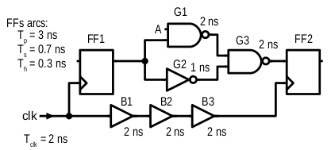

   Exercise 4 circuit.

*Tasks: For the FF1 to FF2 timing path do:*

- *Calculate launch and capture clock timing.*
- *Calculate setup and hold slack.*

The new aspect in this example is existence of multiple data paths from ``FF1/CK`` to ``FF2/D`` and we
need to determine the *latest* and *earliest* ones. From the two paths in our case the one through G1 is
obviously longer than the other one through G2. Hence we use the former one for the setup check and the latter
one for the hold check.

::

    # Setup slack calculation                               # Hold slack calculation
    Point             Incr   Total                          Point             Incr   Total
    clk (rise)          0        0   <-- launch time -->    clk (rise)          0        0
    FF1/CK              3        3                          FF1/CK              3        3
    G1/B                2        5                          G2/A                1        4
    G3/A                2        7                          G2/B                2        6
    FF2/D               0        7                          FF2/D               0        6
    data arrive                  7                          data arrive                  6
    
    clk (rise)          0        2                          clk (rise)          0        0
    B1/A                2        4                          B1/A                2        2
    B2/A                2        6                          B2/A                2        4
    B3/A                2        8   <-- capture time -->   B3/A                2        6
    FF2/CK              0        8                          FF2/CK              0        6
    FF2 setup          -0.7      7.3                        FF2 hold            0.3      6.3
    data required                7.3                        data required                6.3
    
    slack (required - arrive)    0.3 > 0                    slack (required - arrive)    0.3 > 0 (!!!)
    => setup check passed                                   => hold check FAILED

As in the previous exercise we experience a timing violation, this time on hold. The options for fixing
are as follows:

- Increase the *data arrive* time by

  - increasing the delay in the clock segment unique to the *launch clock* path, or
  - increasing the data path delay (e.g. by inserting new buffers or scaling existing path cells).

- Decreasing the *data required* time by

  - decreasing the delay in the clock segment unique to the *capture clock* path (e.g. remove or
    scale some of the clock buffers), or
  - decreasing the hold time of the capture flop FF2 (e.g. by choosing a different FF cell).

As with the setup violation, fixing the data path is preferred; here we could insert a 1 ns buffer into
the path going through G2. Manipulating clock paths may negatively affect timing paths to FF1 and from FF2;
moreover in our case we do not seem to have enough setup margin.

.. note:: Notice that for the same edge register-to-register path the *data required* clock path
   does not include the cycle time and the timing violation is independent of relaxing the clock
   period. That is why **hold violations are more severe than setup violations**.
   
   Now if you consider the note from `Exercise 2: Effect of Negedge Clocking`_ on serial interfaces
   like I2C using different clock edges to drive and capture data. This practice introduces the cycle
   time into both the setup and hold check calculations. Then there is a chance to fix timing on both
   sides by changing the cycle time and/or the duty cycle.

Exercise 5: Small Circuit Analysis
~~~~~~~~~~~~~~~~~~~~~~~~~~~~~~~~~~

*Objective: Practice timing analysis in a complete circuit with multiple paths and paths of different
types.*

.. figure:: png/circ05.png

   Exercise 5 circuit.

*Tasks: For the given circuit do:*

- *Identify all valid timing paths.*
- *Identify critical paths and calculate the worst setup and hold slack.*

All the previous exercises were obvious about what is the timing path; and also, all the paths analyzed
thus far were register-to-register. In a complete circuits, there will different paths between different
flops and also paths to/from primary ports of the circuit. All these paths need to be analyzed and the
worst slacks considered for assessing STA success or failure.

Introducing primary inputs and outputs in this exercise is only to fool you. Unless you have information
about their timing, you must ignore them. Hence our task here reduces to analyzing only *register-to-register*
paths. The following table summarizes all existing paths and their setup/hold slacks.

======== ========== ================== =================
  From     To        Setup slack [ns]   Hold slack [ns]    
======== ========== ================== =================
 FF1/CK   FF3/D       6.3                -2.7
 FF1/CK   FF4/D       7.3                -1.7
 FF2/CK   FF3/D       2.3                -6.7
 FF3/CK   FF4/D       6.3                -2.7
======== ========== ================== =================

The paths with the smallest slack for setup and hold checks are FF2-to-FF3 and FF1-to-FF4, respectively.
We call these paths *critical paths*.

Exercise 6: Simple Path with  Multiple Clocks
~~~~~~~~~~~~~~~~~~~~~~~~~~~~~~~~~~~~~~~~~~~~~

*Objective: Practice timing analysis of paths with multiple clocks.*

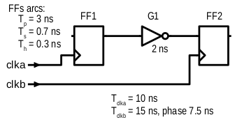

   Exercise 6 circuit.

*Tasks: For the FF1 to FF2 timing path do:*

- *Identify launch and capture clock timing for hold and setup.*
- *Calculate setup and hold slack.*

When the startpoint and endpoint are clocked from different sources, we need to determine the worst case
(i.e. minimum) constellation between launch and capture edges. We do so by expanding clock waveforms to their
least common multiple; in our case the common period is 30 ns (see the figure below).

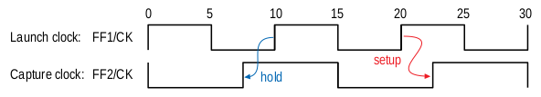

   Waveform of expanding clock to the least common multiple of their periods.

After identifying the worst case conditions we obtain the following slacks::

    # Setup slack calculation                               # Hold slack calculation
    Point             Incr   Total                          Point             Incr   Total
    clka (rise)         0       20   <-- launch time -->    clka (rise)         0       10
    FF1/CK              3       23                          FF1/CK              3       13
    G1/A                2       25                          G2/A                2       15
    FF2/D               0       25                          FF2/D               0       15
    data arrive                 25                          data arrive                 15
    
    clkb (rise)         0       30   <-- capture time -->   clkb (rise)         0        7.5
    FF2/CK              0       30                          FF2/CK              0        7.5
    FF2 setup          -0.7     29.3                        FF2 hold            0.3      7.8
    data required               29.3                        data required                7.8
    
    slack (required - arrive)    4.3 > 0                    slack (required - arrive)   -7.2 < 0
    => setup check passed                                   => hold check passed

Obviously the multi-clock exercise is about expanding the clock waveforms. Below there are two
more examples with clock periods of 10 ns and 30 ns and different phase alignment.

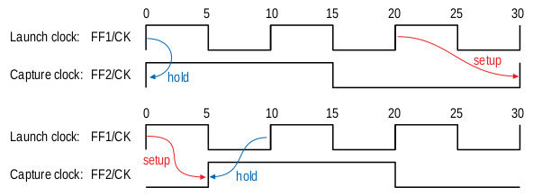

   Examples of other timing variations to Exercise 6 circuit.

Exercise 7: Simple Path with Rise/Fall Delays
~~~~~~~~~~~~~~~~~~~~~~~~~~~~~~~~~~~~~~~~~~~~~

*Objective: Practice timing analysis with more complex timing model such as different rise/fall delays.*

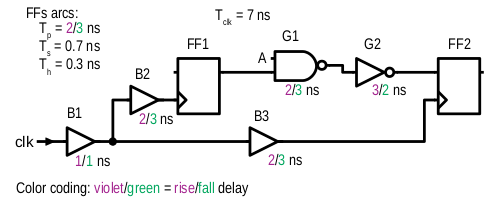

   Exercise 7 circuit.

*Tasks: For the FF1 to FF2 timing path do:*

- *Calculate rise/fall delays of data and clock paths.*
- *Calculate setup and hold slack.*
- *How would the results change if FF2 were negedge triggered?*

All preceding exercises worked with a simple timing model that had constant cell arcs. Now we
consider a model where rise and fall cell arcs yield different delays. This change forces timing
analysis to calculate and consider valid combinations of rise and fall signal propagations.

The rise/fall timing arcs are related to rise/fall at the output of a cell! The following table
then summarizes propagation delays of individual paths/segments. An example of calculating the
segment ``FF1/CK`` to ``FF2/D`` appears in the figure below.

========== ======== ============= ================
Start      End      Change        Path delay [ns]
========== ======== ============= ================
FF1/CK     FF2/D    rise (FF1/Q)  8
FF1/CK     FF2/D    fall (FF1/Q)  7
clk        FF1/CK   rise (clk)    3
clk        FF1/CK   fall (clk)    4
clk        FF2/CK   rise (clk)    3
clk        FF2/CK   fall (clk)    4
========== ======== ============= ================

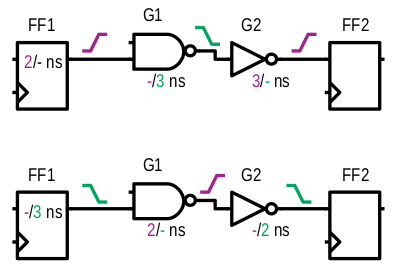

   Calculation of ``FF1/Q`` rise/fall propagation through the data path.

For the setup slack we need to consider the *late* data path and *early* clock path; and vice versa
for the hold slack. On ``FF1/CK`` to ``FF2/D`` the late/early occurs on ``FF1/Q`` rise/fall. On clock
paths, do not get fooled; only ``clk`` rise will trigger launch and capture! The slack calculation
comes out as follows (note that we use cell arcs ends in the listing as it better correlates with
values in the circuit's figure)::

    # Setup slack calculation                               # Hold slack calculation
    Point             Incr   Total                          Point             Incr   Total
    clk (r)             0        0                          clk (r)             0        0
    B1/Y (r)            1        1                          B1/Y (r)            1        1
    B2/Y (r)            2        3   <-- launch time -->    B2/Y (r)            2        3
    FF1/Q (r)           2        5                          FF1/Q (f)           3        6
    G1/Y (f)            3        8                          G1/Y (r)            2        8
    G2/Y (r)            3       11                          G2/Y (f)            2       10
    FF2/D (r)           0       11                          FF2/D (f)           0       10
    data arrive                 11                          data arrive                 10
    
    clk (r)             0        7                          clk (r)             0        0
    B1/Y (r)            1        8                          B1/Y (r)            1        1
    B3/Y (r)            2       10   <-- capture time -->   B3/Y (r)            2        3
    FF2/CK (r)          0       10                          FF2/CK (r)          0        3
    FF2 setup          -0.7      9.3                        FF2 hold            0.3      3.3
    data required                9.3                        data required                3.3
    
    slack (required - arrive)   -1.7 < 0 (!!!)              slack (required - arrive)   -6.7 < 0
    => setup check FAILED                                   => hold check passed

If FF2 were negedge triggered, then we would need to consider the ``clk`` fall propagation delay
to ``FF2/CK`` and also would need to account for changed launch/capture edge timing::

    # Setup slack calculation                               # Hold slack calculation
    Point             Incr   Total                          Point             Incr   Total
    clk (r)             0        0                          clk (r)             0        7
    ...                                                     ...
    data arrive                 11                          data arrive                 17
    
    clk (f)             0        3.5                        clk (f)             0        3.5
    B1/Y (f)            1        4.5                        B1/Y (f)            1        4.5
    B3/Y (f)            3        7.5 <-- capture time -->   B3/Y (f)            3        7.5
    FF2/CK (f)          0        7.5                        FF2/CK (f)          0        7.5
    FF2 setup          -0.7      6.8                        FF2 hold            0.3      7.8
    data required                6.8                        data required                7.8
    
    slack (required - arrive)   -4.2 < 0 (!!!)              slack (required - arrive)   -9.2 < 0
    => setup check FAILED                                   => hold check passed

Technology Libraries
....................

Technology libraries are files that provide to EDA tools information about standard cells (and
other cell types or IPs) that may be used in a design. These libraries have many formats, some
proprietary, some standardized, tailored for each EDA function.

STA tools need in general the following basic information:

- list of cells and their logic function
- cell characterization data (timing, capacitance, optionally power)

Liberty Format
~~~~~~~~~~~~~~

An industry standard, *(Synopsys) Liberty* (``*.lib``), is a format used by most tools and
provided by technology vendors [#]_. Liberty syntax is fixed but open-ended; that is, it
is a hierarchical structure of attributes and groups/collections, where groups contain lower
level attributes and groups.

.. TBD consider adding reference to Liberty User Guide

The Liberty syntax then looks like follows::

    library(my_lib) {
        /* comments */
        
        simple_attribute: my_attr_value;
        
        complex_attribute ( my_complex_attr_value );
        
        some_group (my_group_b) {
            /* lower level attribbutes */
            /* lower level groups */
        }
        
        ...
    }

Most of the core attributes and groups are standardized and the typical Liberty looks like
follows::

    library(my_lib) {
        /* Library attributes */
        technology (cmos);
        delay_model: table_lookup;
        
        ... /* other library-level attributes */
        
        /* Cell definitions */
        cell(my_cell_a) {
            ...
        }
        
        ... /* other cell definitions */
    }

.. [#] The Liberty format has been developed by Synopsys which now collaborates with its partners
   on its future development. For that the open-ended semantics of the format works pretty well,
   but sometimes becomes a source of incompatibilities. That is, different EDA vendors define
   their own attributes or collections that other EDA vendors may not support.

Library Attributes
~~~~~~~~~~~~~~~~~~

The common library-level attributes are:

- General library type attributes (e.g. ``technology``, ``delay_model``).
- Units attributes: Define units associated with numeric literals.

  ::
  
      /* units attributes*/
      time_unit: "1ns";
      voltage_unit: "1V";
      ...
- Threshold attributes: Identify waveform cross points where the library was characterized.
  It is used to recalculate the characterized values when mixing cells with different thresholds.

  ::
  
      /* thresholds */
      slew_upper_threshold_pct_rise: 80;
      slew_lower_threshold_pct_rise: 20;
      ...
      input_threshold_pct_rise: 50;
      input_threshold_pct_fall: 50;
      ...

- Process attributes: Define operating conditions for which the library was characterized.

  ::
  
      nom_process: 1.0;
      nom_voltage: 1.5;
      nom_temperature: 25.0;
      operating_conditions (tc_1p5v_25c) {
          process: 1;
          voltage: 1.5;
          temperature: 25;
      }
      default_operating_conditions : tc_1p5v_25c;

- Default values: Define default nominal characterization values that apply when not specifically
  defined for a cell, pin or other groups.
  
  ::
  
      default_input_pin_cap: 1.0;
      default_output_pin_cap: 1.0;
      ...

Library providers sometimes define their own attributes useful for automation purposes. The following
example shows how to define and use a user-defined cell description::

    /* declare a user attribute */
    define(CELL_DESCR,cell,string);
    
    /* use the attribute */
    cell(AND2x1) {
        CELL_DESCR: "2-input AND with x1 drive strength.";
        ...
    }

Library Cells and Timing
~~~~~~~~~~~~~~~~~~~~~~~~

The core of Liberty libraries is description of cells, their pins, function and timing. The ``cell``
group bundles cell-level attributes (e.g. ``area``, ``leakage``, ``dont_use``, ``dont_touch``, etc.)
and ``pin`` groups for its pins. The ``pin`` group defines pin attributes (e.g. ``direction``, input
``capacitance``, output ``max_capacitance``, logic ``function``) and groups for timing and other
characterization data (e.g. power or current).  Sequential cells also contain groups identifying
the sequential function (e.g. ``ff``) and its attributes (e.g. ``clocked_on``).

The following snippets show some characteristics of a combinational and a sequential cell::

    /* combo cell */
    cell(bufx1) {
        area: 1.2;
        pin(A) {
            direction: input;
            capacitance: 0.001;
        }
        pin(Y) {
            direction: output;
            max_capacitance: 0.05;
            function: "A";
            timing () {
                related_pin        : "A" ;
                timing_type        : combinational ;
                timing_sense       : positive_unate ;
                cell_fall(scalar) { values("2.0"); }
                cell_rise(scalar) { values("2.0"); }
                fall_transition(scalar) { values("0.3"); }
                rise_transition(scalar) { values("0.3"); }
            }
        }
    }
    
    /* sequential cell */
    cell(dffrx1) {
        ...
        ff (Qint,QintB) {
            next_state: "D";
            clocked_on: "CK";
            clear: "!RB";
        }
        pin(CK)  {
            direction: input;
            capacitance: 0.001;
            clock: true;
            timing() {
                related_pin: "CK";
                timing_type: min_pulse_width;                /* specifies min pulse width check */
                rise_constraint(scalar) { values("1.0"); }
                fall_constraint(scalar) { values("1.0"); }
            }
        }
        pin(D) {
            ...
            timing() {
                related_pin: "CK";
                when: "RB";
                sdf_cond: "RB == 1'b1";
                timing_type: hold_rising;                   /* specifies hold check on CK rise */
                rise_constraint(scalar) { values("0.3"); }
                fall_constraint(scalar) { values("0.3"); }
            }
            timing() {
                ...
                timing_type: setup_rising;                  /* specifies setup check on CK rise */
                ...
            }
        }
        pin(Q) {
            ...
            function: "Qint";                               /* use of internally defined output of the state element */
            timing() {
                related_pin: "CK";
                timing_sense: non_unate;
                timing_type: rising_edge;
                cell_rise(scalar) { values("3.0"); }        /* propagation delay on CK rise*/
                cell_fall(scalar) { values("3.0"); }
                rise_transition(scalar) { values("0.3"); }  /* output transition */
                fall_transition(scalar) { values("0.3"); }
            }
            timing() {
                related_pin: "RB";
                timing_sense: positive_unate;
                timing_type: clear;
                cell_fall(scalar) { values("1.0"); }        /* propagation delay on RB fall */
                fall_transition(scalar) { values("0.2"); }  /* output transition */
            }
        }
        ...
    }

Timing Tables
~~~~~~~~~~~~~

The cell examples above used single scalar timing values, very similar to what we used in `Examples`_.
In practice, cell delays vary as a function of input signal(s) *slew* and, when it is a propagation delay,
on the total output load (i.e. capacitance). The characterization process sweeps these parameters in
defined ranges (typical for the given technology) and creates a two-dimensional table of characterized
values. These tables are then used for interpolation or extrapolation based on the actual slew and load
values in a circuit. Look at the example of a 5x5 table for cell propagation delay::

    library(my_lib) {
        ... 
        lut_table_template(delay_template_5x5) {
            variable_1 : input_net_transition;
            variable_2 : total_output_net_capacitance;
            index_1 ("1000.0, 1002.0, 1003.0, 1004.0, 1006.0");
            index_2 ("1000.0, 1002.0, 1003.0, 1004.0, 1006.0");
        }   
        ... 
        cell(my_cell) {
            ... 
            pin(Y)  {
                ...
                function : "(!A)";
                timing() {
                    related_pin : "A";
                    timing_sense : negative_unate;
                    cell_rise(delay_template_5x5) {
                        index_1 ("0.008, 0.08, 0.12, 0.16, 0.30");
                        index_2 ("0.01, 0.05, 0.08, 0.12, 0.24");
                        values ( \ 
                            "0.082, 0.369, 0.585, 0.872, 1.90", \
                            "0.108, 0.394, 0.610, 0.897, 1.93", \
                            "0.123, 0.408, 0.624, 0.912, 1.94", \
                            "0.137, 0.424, 0.637, 0.925, 1.96", \
                            "0.182, 0.468, 0.683, 0.967, 2.01");
                    }   
                    cell_fall(delay_template_5x5) {
                        ... 
                    }
                    ... 
                }
            } /* Y */
            ... 
        } /* my_cell */
        ... 
    }   

Library Corner
~~~~~~~~~~~~~~

Besides depending on slew and load, cell delays vary with process, voltage and temperature (a.k.a *PVT*)
changes. We will discuss later (`PVT Variations`_) on how this dependency looks like. The key point here is that every
cell library needs to be characterized over different PVT combinations and delivered as a group of ``*.lib``
files. The choice of PVT combinations come from typical operating conditions for the library cells (e.g.
nominal voltage plus/minus 10%, industrial temperature range of -40 C to 125 C) and process variance (i.e.
typically slowest/worst and fastest/best transistors).

IP Timing Libraries
~~~~~~~~~~~~~~~~~~~

We have discussed Liberty and timing in the context of standard cells. A full chip design typically includes
other cell types, often referred to as IPs, such as IO cells, memories and special hard macros (e.g. PLL,
high-speed physical interfaces, etc.).

These IPs need to come with the same technology libraries as standard cells, and thus also with timing in the
Liberty format. In that regard, each IP is just another ``cell`` with its characteristic attributes, pin and
timing groups. The timing, if defined, is defined very similarly to as if it were a sequential or combinational
cell, whichever is more appropriate.

Therefore from the timing perspective, STA analysis eventually treats any IP as a cell that comes with standard
sequential timing *constraints* (e.g. setup/hold) or adds its propagation delays to a *signal path*.

PrimeTime Hands-on
..................

This section is about practicing STA analysis with a help of an STA tool. We will be using Synopsys PrimeTime (PT),
but the principle applies to other STA tools and is no different for ASICs and FPGAs. This practice will teach
you how to define basic user constraints (e.g. identify a clock and its cycle time) and how to report STA results
(i.e. have a control over what timing checks to analyze).

You will go through the same series of exercises we did in the `Examples`_ section.

STA Session
~~~~~~~~~~~

A typical STA session does the following:

1. Loads technology libraries.
2. Loads the design.
3. Defines user timing constraints.
4. Analyzes the design.
5. Reports analysis results.

Steps 3 to 5 will be practiced  during exercises. Steps 1 and 2 in PrimeTime look like follows::

    # Set paths to technology libraries (part of Step 1). Notice the use
    # of a compiled Liberty  format *.db (rather than the plain text *.lib).
    set link_path path/to/my_lib.db
    
    # Load the design (part of Step 2).
    read_verilog path/to/my_circuit.v
    
    # Link the libraries and design (completion of Step 1 and 2).
    link
    
    ... # other Steps

.. note:: In the `Technology Libraries`_ section we introduced the syntax of ``*.lib`` Liberty files. These
   are plain text files and can grow pretty large as the number of cells and characterized parameters increases.
   Some tools therefore use a proprietary binary format converted from the ``*.lib`` one. For example, PrimeTime
   uses ``*.db`` files compiled with the Synopsys LibraryCompiler tool.

.. note:: Productivity tip: Starting the PrimeTime and getting a license takes some time. Rather than leaving
   the session and starting the tool again, you can reset the configuration by unloading the design and the
   techonology library, then loading the new ones::
   
       # unload the design
       remove_design [current_design]
       
       # unload the librarym, where <libname> is the library name, usually
       # the base name of the library file
       remove_library <libname>

PT Exercise 1: Simple FF-to-FF Path
~~~~~~~~~~~~~~~~~~~~~~~~~~~~~~~~~~~

*Objective: Show that with no clock definition* ``report_timing`` *has nothing to report. Learn how to define
a clock and report analysis results.*

*Tasks:*

- *Set up PT session using* ``circ01.v`` *and* ``sample_lib1.db``.
- *Use* ``report_timing`` *to see results without any user constraints.*
- *Define clock and a clock period constraint with* ``create_clock``.
- *Report results of setup and hold timing checks. Compare with results computed in* `Exercise 1: Simple FF-to-FF Path`_.

Here is how the exercise may proceed:

1. Change to a working folder and start PT::

       cd ...
       pt_shell

2. Setup the STA session for analysis::

       pt_shell> set link_path sample_lib1.db
       pt_shell> read_verilog circ01.v
       pt_shell> link
       Loading verilog file '.../circ01.v'
       Loading db file '.../sample_lib1.db'
       Linking design circ01...
       Information: 7 (77.78%) library cells are unused in library sample_lib1..... (LNK-045)
       Information: total 7 library cells are unused (LNK-046)
       Design 'circ01' was successfully linked.
       Information: There are 7 leaf cells, ports, hiers and 5 nets in the design (LNK-047)

.. note:: The compiled ``*.db`` file needs to be created by Synopsys ``lc_shell`` (LibraryCompiler).
   However, if you tried to use the ``*.lib`` file directly, PrimeTime would try to call LibraryCompiler
   directly and get the compiled library itself. Here is an example of the output::
   
       pt_shell> set link_path sample_lib1.lib
       pt_shell> read_verilog circ01.v
       pt_shell> link
       Beginning read_lib...
       Using exec: /library_compiler/N-2017.12/linux64/lc/bin/lc_shell_exec
       Reading '.../sample_lib1.lib' ...
       Technology library 'sample_lib1' read successfully
       Loading verilog file '.../circ01.v'
       Loading db file '.../sample_lib1.lib'
       Loading db file '/tmp/_pt1r2wdkga/1.db'
       Linking design circ01...
       Design 'circ01' was successfully linked.
       Information: ...

3. Try reporting STA results. You will see nothing reported as we have not set any constraints
   yet::

       pt_shell> report_timing
       ****************************************
       Report : timing
               -path_type full
               -delay_type max
               -max_paths 1
               -sort_by slack
       Design : circ01
       Version: O-2018.06-SP4
       Date   : Mon Jul 29 18:49:07 2019
       ****************************************
       
       No constrained paths.

4. Define a clock with certain period::

       # A clock is defined using:
       #   create_clock -name <ID> -period <cycle-time> <clock_port>
       #
       # The <ID> may be whatever name you choose, but better not to collide with names
       # of other objects, such as primary ports, design and instances of modules or cells.
       # The <cycle-time> is a clock period specified as a floating-point number (the units
       # are defined by the library).
       #
       # Without other options, the command will define a clock with the following waveform,
       # where `T` is the used <cycle-time>.
       #     ________________ 
       #    |                |________________|
       #    0               T/2               T
       
       pt_shell> create_clock -name CLK -period 20 clk

5. Report results of setup check analysis::

       # When `report_timing` is called without other options it prints the results
       # of setup check with the worst slack.
       pt_shell> report_timing
       ****************************************
       Report : timing
        -path_type full
        -delay_type max
        -max_paths 1
        -sort_by slack
       Design : circ01
       Version: O-2018.06-SP4
       Date   : Sun Jun 23 08:40:57 2019
       ****************************************

         Startpoint: FF1 (rising edge-triggered flip-flop clocked by CLK)
         Endpoint: FF2 (rising edge-triggered flip-flop clocked by CLK)
         Path Group: CLK
         Path Type: max

         Point                                    Incr       Path
         ---------------------------------------------------------------
         clock CLK (rise edge)                   0.000      0.000
         clock network delay (ideal)             0.000      0.000
         FF1/CK (dffrx1)                         0.000      0.000 r
         FF1/Q (dffrx1)                          3.000      3.000 f
         G1/Y (invx1)                            2.000      5.000 r
         FF2/D (dffrx1)                          0.000      5.000 r
         data arrival time                                  5.000

         clock CLK (rise edge)                  20.000     20.000
         clock network delay (ideal)             0.000     20.000
         clock reconvergence pessimism           0.000     20.000
         FF2/CK (dffrx1)                                   20.000 r
         library setup time                     -0.700     19.300
         data required time                                19.300
         ---------------------------------------------------------------
         data required time                                19.300
         data arrival time                                 -5.000
         ---------------------------------------------------------------
         slack (MET)                                       14.300

6. To report the hold check results you must use ``-delay_type min``::

       # Report hold timing.
       pt_shell> report_timing -path_type full_clock_expanded -delay_type min
       ****************************************
       Report : timing
        -path_type full
        -delay_type min
        -max_paths 1
        -sort_by slack
       Design : circ01
       Version: O-2018.06-SP4
       Date   : Sun Jun 23 08:40:46 2019
       ****************************************

         Startpoint: FF1 (rising edge-triggered flip-flop clocked by CLK)
         Endpoint: FF2 (rising edge-triggered flip-flop clocked by CLK)
         Path Group: CLK
         Path Type: min

         Point                                    Incr       Path
         ---------------------------------------------------------------
         clock CLK (rise edge)                   0.000      0.000
         clock network delay (ideal)             0.000      0.000
         FF1/CK (dffrx1)                         0.000      0.000 r
         FF1/Q (dffrx1)                          3.000      3.000 f
         G1/Y (invx1)                            2.000      5.000 r
         FF2/D (dffrx1)                          0.000      5.000 r
         data arrival time                                  5.000

         clock CLK (rise edge)                   0.000      0.000
         clock network delay (ideal)             0.000      0.000
         clock reconvergence pessimism           0.000      0.000
         FF2/CK (dffrx1)                                    0.000 r
         library hold time                       0.300      0.300
         data required time                                 0.300
         ---------------------------------------------------------------
         data required time                                 0.300
         data arrival time                                 -5.000
         ---------------------------------------------------------------
         slack (MET)                                        4.700

7. Setup slack of 14.3 ns and hold slack of 4.7 ns (notice that the PT report automatically negates
   the result to make a passed check have a positive slack) correspond to `Exercise 1: Simple FF-to-FF Path`_.

PT Exercise 2: Effect of Negedge Clocking
~~~~~~~~~~~~~~~~~~~~~~~~~~~~~~~~~~~~~~~~~

*Objective: Show timing reports for a circuit with different edge flops.*

*Tasks:*

- *Set up PT session using* ``circ02.v`` *and* ``sample_lib1.db``.
- *Define clock and a clock period constraint.*
- *Report results of setup and hold timing checks. Compare with results computed in* `Exercise 2: Effect of Negedge Clocking`_.

There is nothing new to the preceding PT exercise. The tool reports shall look
like below (yielding setup and hold slack 4.3 and 14.7, respectively)::

    ****************************************                                 ****************************************
    Report : timing                                                          Report : timing
    	-path_type full                                                      	-path_type full
    	-delay_type max                                                      	-delay_type min
    	-max_paths 1                                                         	-max_paths 1
    	-sort_by slack                                                       	-sort_by slack
    Design : circ02                                                          Design : circ02
    Version: O-2018.06-SP4                                                   Version: O-2018.06-SP4
    Date   : Mon Jul 29 19:17:39 2019                                        Date   : Mon Jul 29 19:17:48 2019
    ****************************************                                 ****************************************
      Startpoint: FF1 (rising edge-triggered flip-flop clocked by CLK)         Startpoint: FF1 (rising edge-triggered flip-flop clocked by CLK)
      Endpoint: FF2 (falling edge-triggered flip-flop clocked by CLK)          Endpoint: FF2 (falling edge-triggered flip-flop clocked by CLK)
      Path Group: CLK                                                          Path Group: CLK
      Path Type: max                                                           Path Type: min
                                                                             
      Point                                    Incr       Path                 Point                                    Incr       Path
      ---------------------------------------------------------------          ---------------------------------------------------------------
      clock CLK (rise edge)                    0.00       0.00                 clock CLK (rise edge)                   20.00      20.00
      clock network delay (ideal)              0.00       0.00                 clock network delay (ideal)              0.00      20.00
      FF1/CK (dffrx1)                          0.00       0.00 r               FF1/CK (dffrx1)                          0.00      20.00 r
      FF1/Q (dffrx1)                           3.00       3.00 f               FF1/Q (dffrx1)                           3.00      23.00 f
      G1/Y (invx1)                             2.00       5.00 r               G1/Y (invx1)                             2.00      25.00 r
      FF2/D (dffnrx1)                          0.00       5.00 r               FF2/D (dffnrx1)                          0.00      25.00 r
      data arrival time                                   5.00                 data arrival time                                  25.00
                                                                             
      clock CLK (fall edge)                   10.00      10.00                 clock CLK (fall edge)                   10.00      10.00
      clock network delay (ideal)              0.00      10.00                 clock network delay (ideal)              0.00      10.00
      clock reconvergence pessimism            0.00      10.00                 clock reconvergence pessimism            0.00      10.00
      FF2/CKN (dffnrx1)                                  10.00 f               FF2/CKN (dffnrx1)                                  10.00 f
      library setup time                      -0.70       9.30                 library hold time                        0.30      10.30
      data required time                                  9.30                 data required time                                 10.30
      ---------------------------------------------------------------          ---------------------------------------------------------------
      data required time                                  9.30                 data required time                                 10.30
      data arrival time                                  -5.00                 data arrival time                                 -25.00
      ---------------------------------------------------------------          ---------------------------------------------------------------
      slack (MET)                                         4.30                 slack (MET)                                        14.70  
    

PT Exercise 3: Simple FF-to-FF Path with Clock Tree
~~~~~~~~~~~~~~~~~~~~~~~~~~~~~~~~~~~~~~~~~~~~~~~~~~~

*Objective: Show timing reports for a circuit with a clock tree.*

*Tasks:*

- *Set up PT session using* ``circ03.v`` *and* ``sample_lib1.db``.
- *Define clock and a clock period constraint.*
- *Report results of setup and hold timing checks. Compare with results computed in* `Exercise 3: Simple FF-to-FF Path with Clock Tree`_.

The analysis procedure is as in the preceding examples. However, we do extend
``report_timing`` options to get a complete clock path listing.

::

       # Unless specified otherwise, timing reports condense clock paths to a single
       # value. Use `-path_type full_clock_expanded` to get the complete path listing.
       pt_shell> report_timing -path_type full_clock_expanded

The full setup/hold listing then looks like follows::

    ****************************************                               ****************************************
    Report : timing                                                        Report : timing
    	-path_type full_clock_expanded                                     	-path_type full_clock_expanded
    	-delay_type max                                                    	-delay_type min
    	-max_paths 1                                                       	-max_paths 1
    	-sort_by slack                                                     	-sort_by slack
    Design : circ03                                                        Design : circ03
    Version: O-2018.06-SP4                                                 Version: O-2018.06-SP4
    Date   : Mon Jul 29 19:16:43 2019                                      Date   : Mon Jul 29 19:16:53 2019
    ****************************************                               ****************************************
      Startpoint: FF1 (rising edge-triggered flip-flop clocked by CLK)       Startpoint: FF1 (rising edge-triggered flip-flop clocked by CLK)
      Endpoint: FF2 (rising edge-triggered flip-flop clocked by CLK)         Endpoint: FF2 (rising edge-triggered flip-flop clocked by CLK)
      Last common pin: clk                                                   Last common pin: clk
      Path Group: CLK                                                        Path Group: CLK
      Path Type: max                                                         Path Type: min
                                                                           
      Point                                    Incr       Path               Point                                    Incr       Path
      ---------------------------------------------------------------        ---------------------------------------------------------------
      clock CLK (rise edge)                    0.00       0.00               clock CLK (rise edge)                    0.00       0.00
      clock source latency                     0.00       0.00               clock source latency                     0.00       0.00
      clk (in)                                 0.00       0.00 r             clk (in)                                 0.00       0.00 r
      B1/Y (bufx4)                             1.00       1.00 r             B1/Y (bufx4)                             1.00       1.00 r
      B2/Y (bufx1)                             2.00       3.00 r             B2/Y (bufx1)                             2.00       3.00 r
      FF1/CK (dffrx1)                          0.00       3.00 r             FF1/CK (dffrx1)                          0.00       3.00 r
      FF1/Q (dffrx1)                           3.00       6.00 r             FF1/Q (dffrx1)                           3.00       6.00 r
      G1/Y (nand2x1)                           2.00       8.00 f             G1/Y (nand2x1)                           2.00       8.00 f
      G2/Y (invx1)                             2.00      10.00 r             G2/Y (invx1)                             2.00      10.00 r
      FF2/D (dffrx1)                           0.00      10.00 r             FF2/D (dffrx1)                           0.00      10.00 r
      data arrival time                                  10.00               data arrival time                                  10.00
                                                                           
      clock CLK (rise edge)                    7.00       7.00               clock CLK (rise edge)                    0.00       0.00
      clock source latency                     0.00       7.00               clock source latency                     0.00       0.00
      clk (in)                                 0.00       7.00 r             clk (in)                                 0.00       0.00 r
      B1/Y (bufx4)                             1.00       8.00 r             B1/Y (bufx4)                             1.00       1.00 r
      B3/Y (bufx1)                             2.00      10.00 r             B3/Y (bufx1)                             2.00       3.00 r
      FF2/CK (dffrx1)                          0.00      10.00 r             FF2/CK (dffrx1)                          0.00       3.00 r
      clock reconvergence pessimism            0.00      10.00               clock reconvergence pessimism            0.00       3.00
      library setup time                      -0.70       9.30               library hold time                        0.30       3.30
      data required time                                  9.30               data required time                                  3.30
      ---------------------------------------------------------------        ---------------------------------------------------------------
      data required time                                  9.30               data required time                                  3.30
      data arrival time                                 -10.00               data arrival time                                 -10.00
      ---------------------------------------------------------------        ---------------------------------------------------------------
      slack (VIOLATED)                                   -0.70               slack (MET)                                         6.70  

PT Exercise 4: Parallel FF-to-FF Paths
~~~~~~~~~~~~~~~~~~~~~~~~~~~~~~~~~~~~~~

*Objective: Practice timing reports with* ``-from``, ``-through`` *and* ``-to`` *options.*

*Tasks:*

- *Set up PT session using* ``circ04.v`` *and* ``sample_lib1.db``.
- *Define clock and a clock period constraint.*
- *Report timing analysis results for the following paths:*

  - *from FF1*
  - *from FF1/CK to FF2/D*
  - *to FF2/Q*
  - *through G2*

Again, there should be nothing surprising with the standard setup and hold
analysis procedure; the results would come out as in `Exercise 4: Parallel FF-to-FF Paths`_.

Existence of parallel paths between FF1 and FF2 lets you see the effect of
specifying the timing path more precisely. The commands to exercise would
be as follows:

1. Specifying only the startpoint will yield the same results as if it were
   omitted. The reason is that there is a single timing path in the circuit
   and so there is nothing else to report.

   ::

       # Specifying a path by a startpoint
       pt_shell> report_timing -from FF1
       ...

2. Specifying both the startpoint and the endpoint. This time we specify the points
   up to a an instance pin. Again, you will get the same report as previously as
   we identify the only path in the design.

   ::

       # Specifying a path by both startpoint and endpoint
       pt_shell> report_timing -from FF1/CK -to FF2/D
       ...

3. Specifying an enpoint only would again yield the only timing path in the
   design, should the enpoint be specified correctly. Notice the assignment
   asks for using ``FF2/Q`` as the endpoint, but a flop output cannot be an
   endpoint of a timing path. So you should see the STA tool complain:: 

       # Specifying a wrong endpoint
       pt_shell> report_timing -to FF2/Q
       ****************************************
       Report : timing
       	-path_type full
       	-delay_type max
       	-max_paths 1
       	-sort_by slack
       Design : circ04
       Version: O-2018.06-SP4
       Date   : Sat Aug 24 18:26:49 2019
       ****************************************
       
       Warning: There is 1 invalid end point for constrained paths. (UITE-416)
       No constrained paths.

4. Using the ``-through`` point lets you choose the signal path for analysis
   other than the worst case one. In `Exercise 4: Parallel FF-to-FF Paths`_
   we identified that the path through G1 yields the worst setup timing.
   Hence changing the *through* point to G2 will report greater slack.

   ::

       # Specifying a path through a particular gate
       pt_shell> report_timing -through G2
       ****************************************
       Report : timing
       	-path_type full
       	-delay_type max
       	-max_paths 1
       	-sort_by slack
       Design : circ04
       Version: O-2018.06-SP4
       Date   : Sat Aug 24 18:27:12 2019
       ****************************************
         Startpoint: FF1 (rising edge-triggered flip-flop clocked by CLK)
         Endpoint: FF2 (rising edge-triggered flip-flop clocked by CLK)
         Last common pin: clk
         Path Group: CLK
         Path Type: max
       
         Point                                    Incr       Path
         ---------------------------------------------------------------
         clock CLK (rise edge)                    0.00       0.00
         clock network delay (propagated)         0.00       0.00
         FF1/CK (dffrx1)                          0.00       0.00 r
         FF1/Q (dffrx1)                           3.00       3.00 r
         G2/A (invx4) <-                          0.00       3.00 r
         G2/Y (invx4) <-                          1.00       4.00 f
         G3/Y (nand2x1)                           2.00       6.00 r
         FF2/D (dffrx1)                           0.00       6.00 r
         data arrival time                                   6.00
       
         clock CLK (rise edge)                    2.00       2.00
         clock network delay (propagated)         6.00       8.00
         clock reconvergence pessimism            0.00       8.00
         FF2/CK (dffrx1)                                     8.00 r
         library setup time                      -0.70       7.30
         data required time                                  7.30
         ---------------------------------------------------------------
         data required time                                  7.30
         data arrival time                                  -6.00
         ---------------------------------------------------------------
         slack (MET)                                         1.30

PT Exercise 5: Small Circuit Analysis
~~~~~~~~~~~~~~~~~~~~~~~~~~~~~~~~~~~~~

*Objective: Practice timing timing analysis of a more complex circuit.*

*Tasks:*

- *Unless provided with a netlist, create one based on the circuit from* `Exercise 5: Small Circuit Analysis`_.
- *Set up PT session using* ``sample_lib1.db``.
- *Define clock and a clock period constraint.*
- *Identify paths with the worst setup and hold slacks.*
- *Identify worst slacks for all timing paths.*

The first part is easy. The paths with the worst setup and hold slacks are reported
by default ``report_timing -delay_type max`` and ``report_timing -delay_type min``.

To report the other paths we need to use other ``report_timing`` options. Of particular
interest are these two:

- ``-nworst N``: Reports up to N worst paths per endpoint. That is, if there were
  more parallel paths such as in `Exercise 4: Parallel FF-to-FF Paths`_, using ``-nworst``
  would report those paths. However, if you tried that on Exercise 4, you would
  need to use N of three or more. The reason is that, in this case, the worst path
  covers both signal rise and fall transitions and so the second paths gets
  reported on the third place.

  This setting defaults to 1.

- ``-maxpaths M``:  Reports up to M number of paths. As the paths are normally sorted
  by slack, this would report M worst paths.

  This setting defaults to 1.

  The ``maxpath`` has one gotcha. Unless overriden, it sets the ``-slack_lesser_than``
  to 0, meaning that only violating paths get reported by default. In our examples
  you thus need to use some large enough slack limit, e.g. ``-slack_lesser_than 100``.

The two options, ``nworst`` and ``maxpaths`` are often combined together. In cases
where you care only for one of many paths to an endpoint, you would use
``-max_paths N -nworst 1``. Try it out to collect the worst slacks in our example.

There is one more improvement we can do. We care only for slacks, not for all the
details of the paths. We can use the ``-path_type summary`` option to get a less
verbose report::

    pt_shell> report_timing -slack_lesser_than 100 -nworst 4 -max_paths 10 -path_type summary
        
    ****************************************              ****************************************
    Report : timing                                       Report : timing
    	-path_type summary                                	-path_type summary
    	-delay_type max                                   	-delay_type min
    	-nworst 4                                         	-nworst 4
    	-slack_lesser_than 100.00                         	-slack_lesser_than 100.00
    	-max_paths 100                                    	-max_paths 100
    	-sort_by slack                                    	-sort_by slack
    Design : circ05                                       Design : circ05
    Version: O-2018.06-SP4                                Version: O-2018.06-SP4
    Date   : Sat Aug 24 18:43:29 2019                     Date   : Sat Aug 24 18:43:37 2019
    ****************************************              ****************************************
                                                          
    Startpoint            Endpoint             Slack      Startpoint            Endpoint             Slack
    -------------------------------------------------     --------------------------------------------------
    FF2/CK (dffrx1)       FF3/D (dffrx1)       2.30       FF1/CK (dffrx1)       FF4/D (dffrx1)       1.70
    FF2/CK (dffrx1)       FF3/D (dffrx1)       2.30       FF1/CK (dffrx1)       FF4/D (dffrx1)       1.70
    FF3/CK (dffrx1)       FF4/D (dffrx1)       6.30       FF3/CK (dffrx1)       FF4/D (dffrx1)       2.70
    FF3/CK (dffrx1)       FF4/D (dffrx1)       6.30       FF3/CK (dffrx1)       FF4/D (dffrx1)       2.70
    FF1/CK (dffrx1)       FF3/D (dffrx1)       6.30       FF1/CK (dffrx1)       FF3/D (dffrx1)       2.70
    FF1/CK (dffrx1)       FF3/D (dffrx1)       6.30       FF1/CK (dffrx1)       FF3/D (dffrx1)       2.70
    FF1/CK (dffrx1)       FF4/D (dffrx1)       7.30       FF2/CK (dffrx1)       FF3/D (dffrx1)       6.70
    FF1/CK (dffrx1)       FF4/D (dffrx1)       7.30       FF2/CK (dffrx1)       FF3/D (dffrx1)       6.70  

PT Exercise 6: Simple Path with Multiple Clocks
~~~~~~~~~~~~~~~~~~~~~~~~~~~~~~~~~~~~~~~~~~~~~~~

*Objective: Show more complex clock definition.*

*Tasks:*

- *Set up PT session using* ``circ06.v`` *and* ``sample_lib1.db``.
- *Define clocks and report slacks for setup and hold.*

To complete the exercise, you need to define the second clock with a proper
phase shift. For that there is the ``-waveform`` option to the ``create_clock``
command. You would use the same option when you needed to define other than
1:1 duty cycle.

::

    # Define a phase shifted clock waveform. The `-waveform {...}` takes
    # a list of times of rise and fall edges. The first number is always
    # the rise edge.
    pt_shell> create_clock -name CLKB -period 15 -waveform {7.5 15} clkb
    ...

PT Exercise 7: Simple Path with Rise/Fall Delays
~~~~~~~~~~~~~~~~~~~~~~~~~~~~~~~~~~~~~~~~~~~~~~~~

*Objective: Practice analysis with transition-dependent timing.*

*Tasks:*

- *Set up PT session using* **circ03.v** *and* **sample_lib2.db**.
- *Define clocks and report slacks for setup and hold.*
- *Report timing having control over the startpoint transition type:*
  
  - ``report_timing -fall_from FF1/Q``
  - ``report_timing -rise_from FF1/Q``

The following reports contrast the fall and rise reports for hold checks::

    ****************************************                               ****************************************
    Report : timing                                                        Report : timing
    	-path_type full_clock_expanded                                     	-path_type full_clock_expanded
    	-delay_type min                                                    	-delay_type min
    	-max_paths 1                                                       	-max_paths 1
    	-sort_by slack                                                     	-sort_by slack
    Design : circ03                                                        Design : circ03
    Version: O-2018.06-SP4                                                 Version: O-2018.06-SP4
    Date   : Sun Jun 23 12:05:40 2019                                      Date   : Sun Jun 23 12:06:39 2019
    ****************************************                               ****************************************
      Startpoint: FF1 (rising edge-triggered flip-flop clocked by CLK)       Startpoint: FF1 (rising edge-triggered flip-flop clocked by CLK)
      Endpoint: FF2 (rising edge-triggered flip-flop clocked by CLK)         Endpoint: FF2 (rising edge-triggered flip-flop clocked by CLK)
      Last common pin: clk                                                   Last common pin: clk
      Path Group: CLK                                                        Path Group: CLK
      Path Type: min                                                         Path Type: min
                                                                           
      Point                                    Incr       Path               Point                                    Incr       Path
      ---------------------------------------------------------------        ---------------------------------------------------------------
      clock CLK (rise edge)                   0.000      0.000               clock CLK (rise edge)                   0.000      0.000
      clock source latency                    0.000      0.000               clock source latency                    0.000      0.000
      clk (in)                                0.000      0.000 r             clk (in)                                0.000      0.000 r
      B1/Y (bufx4)                            1.000      1.000 r             B1/Y (bufx4)                            1.000      1.000 r
      B2/Y (bufx1)                            2.000      3.000 r             B2/Y (bufx1)                            2.000      3.000 r
      FF1/CK (dffrx1)                         0.000      3.000 r             FF1/CK (dffrx1)                         0.000      3.000 r
      FF1/Q (dffrx1)                          3.000      6.000 f  <--        FF1/Q (dffrx1) <-                       2.000      5.000 r  <--
      G1/Y (nand2x1)                          2.000      8.000 r             G1/Y (nand2x1)                          3.000      8.000 f
      G2/Y (invx1)                            2.000     10.000 f             G2/Y (invx1)                            3.000     11.000 r
      FF2/D (dffrx1)                          0.000     10.000 f             FF2/D (dffrx1)                          0.000     11.000 r
      data arrival time                                 10.000               data arrival time                                 11.000
                                                                           
      clock CLK (rise edge)                   0.000      0.000               clock CLK (rise edge)                   0.000      0.000
      clock source latency                    0.000      0.000               clock source latency                    0.000      0.000
      clk (in)                                0.000      0.000 r             clk (in)                                0.000      0.000 r
      B1/Y (bufx4)                            1.000      1.000 r             B1/Y (bufx4)                            1.000      1.000 r
      B3/Y (bufx1)                            2.000      3.000 r             B3/Y (bufx1)                            2.000      3.000 r
      FF2/CK (dffrx1)                         0.000      3.000 r             FF2/CK (dffrx1)                         0.000      3.000 r
      clock reconvergence pessimism           0.000      3.000               clock reconvergence pessimism           0.000      3.000
      library hold time                       0.300      3.300               library hold time                       0.300      3.300
      data required time                                 3.300               data required time                                 3.300
      ---------------------------------------------------------------        ---------------------------------------------------------------
      data required time                                 3.300               data required time                                 3.300
      data arrival time                                -10.000               data arrival time                                -11.000
      ---------------------------------------------------------------        ---------------------------------------------------------------
      slack (MET)                                        6.700               slack (MET)                                        7.700

STA Intermediate Topics
.......................

Circuit External Environment
~~~~~~~~~~~~~~~~~~~~~~~~~~~~

*Exterior* is the part of the analysis environment that lays around the circuit
under analysis. Up to now, the only component of the exterior we modeled was
the clock generator through ``create_clock``. There is usually more that we
need to model.

.. figure:: png/design_exterior.png

   Generic exterior of the design under analysis.

Timing Exceptions
~~~~~~~~~~~~~~~~~

False Path
^^^^^^^^^^

Multi-cycle Path
^^^^^^^^^^^^^^^^

Min/Max Delay Path
^^^^^^^^^^^^^^^^^^

PVT Variations
~~~~~~~~~~~~~~

More Terminology
................

Here we recapitulate terms introduced outside the `Terminology`_ section.

Ideal clock
  Clock whose distribution network is idealized and considered to cause no clock propagation delays.
  Hence for *ideal clocks* there is no *clock skew*.

Clock tree
  Clock distribution network. Normally composed of buffers and inverters that reduce capacitive load
  on clock segments (hence avoiding max cap violations) and intended to balance or disperse clock
  skew.
  
  In theory we will get the best timing results with a fully balanced clock tree where there is
  no clock skew. This is hardly possible in practice and hence the term *ballancing* means minimizing
  the clock skew.
  
  In practice and especially for large circuits, the ideal "no skew" case is not desirable as it would
  make all flops flip in the same moment and hence may cause a large peak in dynamic power. Hence some
  skew is welcome to disperse the sudden current consumption.

Clock skew
  The difference in clock arrival times at clock inputs of flops in the same *clock domain*. In most
  general sense it refers to the maximum such difference.
  
  The term *skew* is also applied to data paths, such as individual bits of a bus.

Clock domain
  Set of sequential elements triggered/clocked from the same clock source.

Critical path
  Timing path with the worst/smallest slack. Critical paths for setup and hold checks (and other checks)
  may be different.

Invalid path
  A path timing of which cannot be determined. There can different reasons for making the path invalid, e.g.
  missing timing constraints, existence of timing exceptions or constant propagation.

PVT corner
  *PVT*, *Corner* or *PVT corner* is the term for an operating condition. *PVT* is a triplet of a process (P),
  voltage (V) and temperature (T). A timing library is characterized for a single PVT condition. Timing is typically
  a monotone function [#]_ of each parameter and so to cover the min/max timing over the range of PVT parameters
  we really need to consider only the min/max values of each parameter. That is, *corners* of the PVT cube.

.. [#] One notable exception is temperature, where there can be a *temperature inversion*, where going from
   max temp down the delay decreases up to a certain ponint wherefrom further temperature decrease cause the
   delay to rise again.

Summary
-------

This material should give you understanding of how static timing analysis works and that **all STA knows about
the circuit comes from constraints**.

Constraints are defined in part by a technology library (``*.lib`` file with setup, hold, min_pulse_width and
other cell timing) and in part by users (through SDC commands such as ``create_clock``, ``set_input_delay``,
``set_output_delay``, etc.).

Your job as a digital designer is to define timing constraints that accurately represent the environment
in which the circuit is to operate, and to relax the timing wherever the default STA checks are too
conservative or fail to adequately model the reality. 

References
----------

.. [Golson2014] Golson, Steve. *Synchronization and Metastability.* Synopsys Users Group (SNUG) Silicon Valley 2014.

.. lessons learned from [Golson2014]_
.. - Metastability on the boundary of two asynchronous domains is a sure thing
.. - Mean time between failures (MTBF) is an inverse of a failure rate
.. - 2FF synchronizer is no miracle and has a MTBF (where failure means 2nd FF going metastable)
..   that is a function of technology parameters, FF design, synchronizer design and receiving clock
..   period
.. - Designers can determine MTBF of a synchronizer (and then of the entire system), but they rarely do
..   (instead they use 2FF synchronizer as a definitive solution)
.. - Conclusions:
..   - Design your 2FF synchronizer to maximize its MTBF (close to each other, minimize load capacitance of
..     the 1st FF)
..   - Relaxing synchonizer clock period exxponentially improves MTBF

.. [Wakerly87] Wakerly, John. *Designer’s Guide to Synchronizers and Metastability, Part I.* Microprocessor Report 1, no. 1 (1987): 4-8.

.. [ChaneyMolnar73] Chaney, Thomas J., Molnar, Charles E. *Anomalous behavior of synchronizer and arbiter circuits.* IEEE Transactions on Computers, 100, no. 4 (1973): 421-422.
